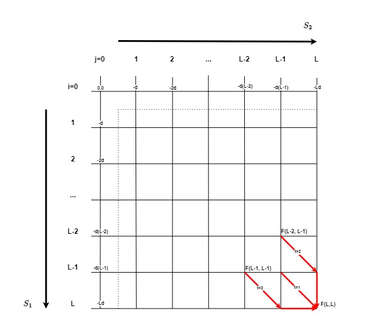

# Search For Similarities
Implementation of an algorithm for finding similarities in a sequence using multiple alignment based on a dynamic programming approach taking into account the correlation of bases by the sliding window method.

Implementations for two operating systems: linux and windows.

## <ins>Classes</ins>
1. Alignment \
    Multiple alignment class. Stores aligned sequences, calculates a position-weight matrix.
2. SmithWaterman \
    A class of the Smith-Waterman algorithm. Stores the nodes and the traversal path of the matrix. Calculates the target evaluation function F.
3. SlidingWindow \
    Sliding window class. Implements the procedure of iterative passage of the sequence. Runs the Smith-Waterman algorithm. Runs a matrix traversal procedure for multiple sequences in threads.

<div>
  
  <p style="text-align: center">Img.1 - Smith-Waterman algorithm</p>
</div>

### <ins>Input parameters:</ins>
align_file - the name of the aligned sequence file located in the folder <em>./data/alignment/</em>; \
dna_file - the name of the chromosome file located in the folder <em>./data/dna/</em>.

### <ins>Adjustable parameters:</ins>
- number of threads;
- mathematical expectation and variance of the total weight of the matrix traversal for random sequences.

### <ins>Output:</ins>
The results of the work are saved to a file in accordance with the name of the multiple alignment file in the folder <em>./data/results/</em>. The file data represents strings of the following format:
```
sequence start_coordinate end_coordinate z-value
```