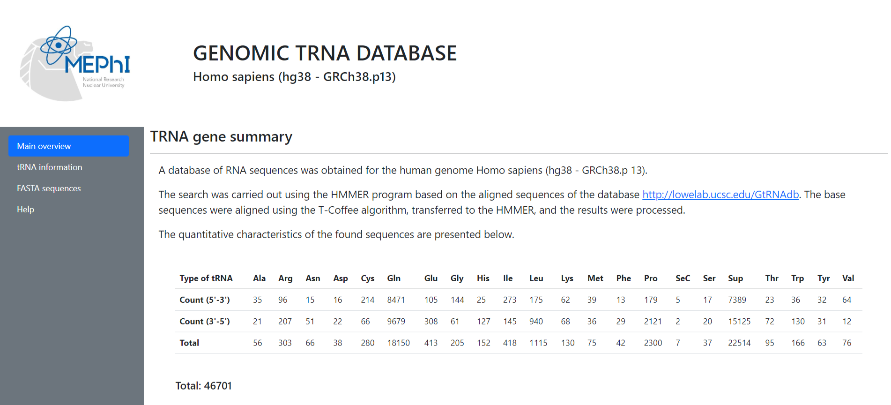
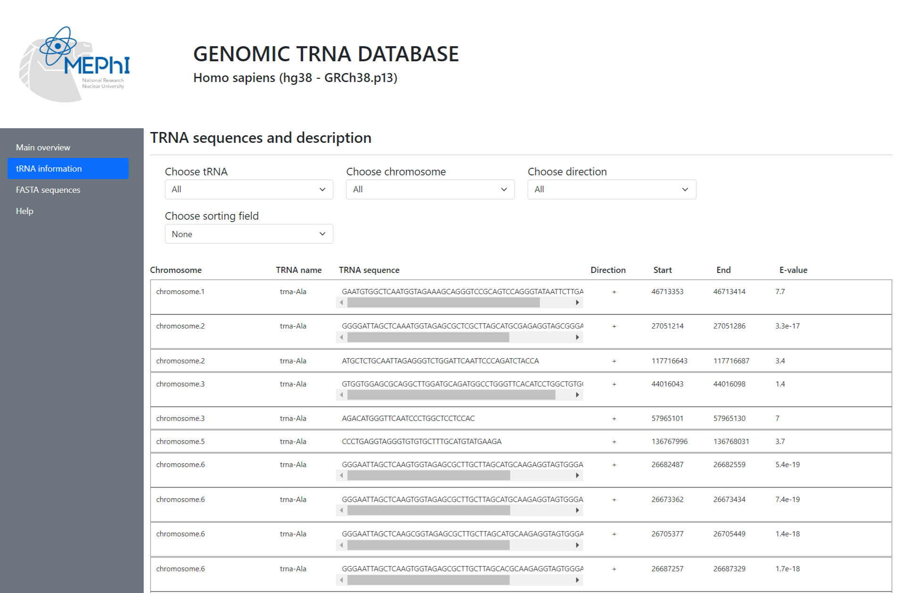

# Database Of tRNA-like Sequences Of The Human Genome
Database of trna-like sequences of the human genome.

A database of RNA sequences was obtained for the human genome Homo sapiens (hg38 - GRCh38.p 13).

The search was carried out using the HMMER program based on the aligned sequences of the database http://lowelab.ucsc.edu/GtRNAdb. The base sequences were aligned using the T-Coffee algorithm, transferred to the HMMER, and the results were processed.

Four-page web application:
1. Home page \
    Description of the database, quantitative characteristics of the data presented.
2. Information about sequences \
    A list of sequences with information about the chromosome, the direction of the sequence, the coordinates of the beginning and end, and z-statistics
3. FASTA sequences \
    Source files of database sequences
4. Contact details

    
    
Img.1 - Main page

    
    
Img.2 - Info page

### Stack technologies MEVN:
- Database MongoDB
- Backend Node JS + ExpressJS
- Frontend VueJS + Bootstrap

